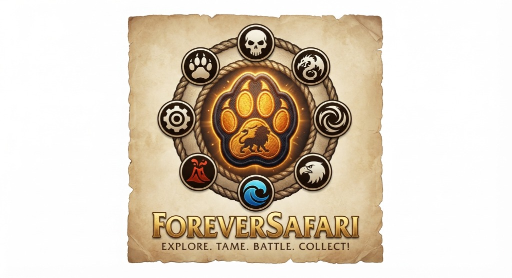

# 🗺️ Forever Safari — Safari Outpost & League System
**The Official Regional Progression, Gym Leaders & Neutral Faction Outposts Guide**  
*World of Warcraft: Forever Beta (`_classic_beta_` / `dataEnv: 16`)*

<p align="center">
  
</p>

---

## 📖 System Overview

The **Safari Outpost System** is Forever Safari's world-spanning gym and regional league progression framework. Because official World of Warcraft servers maintain strict faction separation, the league is structured as a **Faction-Parallel Regional Circuit** that naturally converges in **Contested Neutral Territories** and culminates at the **Nesingwary Safari Championship**.

```
[ Tier 1: Racial Homelands ] ➔ [ Tier 2: Provincial Outposts ] ➔ [ Tier 3: Capital Grandmasters ] ➔ [ Tier 4: Goblin Cartels ] ➔ [ Tier 5: Neutral Orders ] ➔ [ Apex Championship ]
 (Goldshire / Razor Hill)       (Lakeshire / Crossroads)          (Stormwind / Orgrimmar)            (Booty Bay / Gadgetzan)       (Light's Hope / Thorium)       (Nesingwary Camp STV)
```

---

## 🏛️ Tier 1: Racial Homeland Outposts (Level 10–18)

Entry-level training outposts located near racial starting towns. These introduce trainers to the 8-element combat matrix and award their first regional pins.

### 🛡️ Alliance Homelands
| Outpost Location | Zone | Stationed Leader / NPC Anchor | Primary Family Focus | Homeland Badge |
| :--- | :--- | :--- | :--- | :--- |
| **Goldshire Militia Post** | Elwynn Forest | *Marshal Dughan's Tracker* | 🐾 Canines & Wolves | 🐺 **Timber Badge** |
| **Kharanos Mountaineer Camp** | Dun Morogh | *Tinkertown Mountaineer* | 🐾 Bears & Boars | 🐻 **Crag Badge** |
| **Dolanaar Sentinel Perch** | Teldrassil | *Sentinel of Shadowglen* | 🐾 Sabers & 🦅 Owls | 🌙 **Moonpetal Badge** |

### 🪓 Horde Homelands
| Outpost Location | Zone | Stationed Leader / NPC Anchor | Primary Family Focus | Homeland Badge |
| :--- | :--- | :--- | :--- | :--- |
| **Razor Hill Outrunners** | Durotar | *Durotar Scout Leader* | 🐾 Scorpids & Boars | 🦂 **Durotar Fang Badge** |
| **Bloodhoof Plains Camp** | Mulgore | *Brave of the Plains* | 🐾 Kodos & Tallstriders | 🪶 **Earthmother Badge** |
| **Brill Deathguard Post** | Tirisfal Glades | *Forsaken Taskmaster* | 🦅 Bats & 🐾 Spiders | 💀 **Cryptshade Badge** |

---

## 🌲 Tier 2: Provincial Regional Outposts (Level 18–35)

Mid-level outposts stationed across continental trade roads and defensive keeps.

### 🛡️ Alliance Provinces
| Outpost Location | Zone | Stationed Leader | Thematic Roster Specialization | Provincial Badge |
| :--- | :--- | :--- | :--- | :--- |
| **Sentinel Hill Tower** | Westfall | *Defias Hunter Marshal* | ⚙️ Mechanical Harvesters & Scavengers | 🌾 **Harvest Badge** |
| **Lakeshire Bridge Keep** | Redridge Mountains | *Bailiff Conacher's Scout* | 🐉 Dragon Whelps & 🐾 Serpents | 🏔️ **Ridgecrest Badge** |
| **Darkshire Night Watch** | Duskwood | *Commander of the Night Watch* | 💀 Undead Stalkers & 🐾 Spiders | 🌑 **Dusk Badge** |
| **Thelsamar Excavation** | Loch Modan | *Excavation Prospector* | 🐾 Raptors & 🌊 Crocolisks | ⛏️ **Ironlock Badge** |
| **Auberdine Grove Post** | Darkshore | *Grove Walker Warden* | 🌊 Aquatics & 🌋 Elementals | 🌊 **Mistshore Badge** |

### 🪓 Horde Provinces
| Outpost Location | Zone | Stationed Leader | Thematic Roster Specialization | Provincial Badge |
| :--- | :--- | :--- | :--- | :--- |
| **The Crossroads Outpost** | The Barrens | *Savannah Patrol Master* | 🐾 Hyenas, Raptors & Wind Serpents | 🏜️ **Oasis Badge** |
| **The Sepulcher Watch** | Silverpine Forest | *Shadowfang Watcher* | 🐾 Worgs & 💀 Undead | 🐺 **Moonrage Badge** |
| **Sun Rock Retreat** | Stonetalon Mountains | *Crag Stalker Chieftain* | 🌋 Elementals & 🦅 Crag Flyers | ⛰️ **Stonepeak Badge** |
| **Tarren Mill Encampment** | Hillsbrad Foothills | *Deathguard Stalker* | 🐾 Spiders & Forest Bears | 🌲 **Tarren Badge** |
| **Splintertree Outpost** | Ashenvale | *Warsong Outrider Captain* | 🐾 Nightsabers & Raptors | 🪓 **Warsong Badge** |

---

## 👑 Tier 3: Capital City Apex Grandmasters (Level 35–45)

Stationed in capital military quarters, these elite leaders test trainers on advanced team compositions before they venture into contested neutral lands.

### 🛡️ Alliance Capitals
* **Stormwind City (Military Ward)**: *Royal Guard Master* — **Badge: Lionheart Badge** 🦁
* **Ironforge (The Commons / High Seat)**: *Great Forge Master* — **Badge: Anvil Badge** 🔨
* **Darnassus (Warrior's Terrace)**: *Huntress of Elune* — **Badge: Starfall Badge** 🌟

### 🪓 Horde Capitals
* **Orgrimmar (Valley of Honor)**: *Warlord of the Ring* — **Badge: Warchief's Badge** 🪓
* **Thunder Bluff (Hunter Rise)**: *Plainsrunner Chieftain* — **Badge: Totem Badge** 🪶
* **Undercity (The War Quarter)**: *Royal Apothecary Master* — **Badge: Plaguespore Badge** 🧪

---

## 🪙 Tier 4: Goblin Trade Cartels & Desert Outposts (Level 40–50)

Neutral Steamwheedle Cartel prize-fight rings welcoming both Alliance and Horde challengers.

| Neutral Cartel Hub | Location | Outpost Ring Master | Thematic Focus | Outpost Trophy |
| :--- | :--- | :--- | :--- | :--- |
| **Booty Bay Arena** | Stranglethorn Vale | *Baron Revilgaz's First Mate* | 🌊 Reef Predators & 🦅 Sea Birds | 🏴‍☠️ **The Corsair Trophy** |
| **Gadgetzan Arena** | Tanaris | *Noggenfogger's Golem Handler* | ⚙️ Sand Golems & 🐾 Scorpids | 🏜️ **The Mirage Trophy** |
| **Ratchet Harbor Ring** | The Barrens | *Gazlowe's Wharfmaster* | ⚙️ Steam Mechs & 🌊 Frenzies | ⚓ **The Cogwheel Trophy** |
| **Everlook Frost Ring** | Winterspring | *Winterfall Guild Tracker* | 🐾 Frostsabers & Yeti Champions | ❄️ **The Permafrost Trophy** |

---

## ⚜️ Tier 5: Legendary Neutral Orders (Level 50–60 Endgame Circuit)

The premier endgame circuit stationed at iconic lore strongholds across high-level zones.

| Neutral Order Hub | Zone | Stationed Order Master | Specialization & Roster | Faction Crest |
| :--- | :--- | :--- | :--- | :--- |
| **Argent Dawn** | Eastern Plaguelands *(Light's Hope Chapel)* | *Dawn Inquisitor Vaelin* | 💀 Cleansed Undead & ✨ Holy Magic | ⚜️ **The Dawn Crest** |
| **Thorium Brotherhood** | Searing Gorge *(Thorium Point)* | *Master Blacksmith Burnside* | 🌋 Volcanic Magma & ⚙️ Dark Iron Mechs | 🔨 **The Smoldering Anvil** |
| **Timbermaw Hold** | Felwood / Winterspring Tunnel | *Timbermaw Shaman High-Elder* | 🐾 Ancient Bears, Wolves & Moonkin | 🐻 **The Timbermaw Totem** |
| **Ravenholdt Manor** | Hillsbrad / Alterac Mountain Pass | *Master Assassin Jorach* | 🐾 Stealth Sabers, Spiders & Shadow Bats | 🗡️ **The Syndicate Dagger** |
| **Cenarion Circle** | Moonglade *(Nighthaven)* & Silithus | *Keeper of the Sacred Grove* | 🐉 Fey Dragons, Emerald Whelps & Striders | 🌿 **The Cenarion Branch** |
| **Hydraxian Waterlords** | Azshara Coast *(Duke Hydraxis)* | *Abyssal Tide-Shifter* | 🌊 Deep Sea Horrors & Torrent Elementals | 🌊 **The Abyssal Pearl** |
| **Zandalar Tribe** | Stranglethorn Coast *(Yojamba Isle)* | *Zul'Gurub Loa Speaker* | 🐾 Primal Raptors, Zul Bats & Snakes | 🎭 **The Loa Mask** |

---

## 🏆 The Apex Grand Championship (Stranglethorn Vale)

Stationed at **Hemet Nesingwary's Safari Camp** in central Stranglethorn Vale. Only trainers who have collected **8 Regional Badges and at least 3 Neutral Faction Crests** may issue a formal challenge.

### ⚔️ The 4-Stage Gauntlet:
1. **Sir S. J. Erling**: Master of Avian and Speed Combat (`Flying` / `Magic`).
2. **Ajek Rouache**: Master of Volcanic, Venomous, and Armored Beasts (`Beast` / `Elemental`).
3. **Barnil Stonepot**: Master of Mechanical, Trapping, and Heavy Defense (`Mechanical` / `Aquatic`).
4. **Hemet Nesingwary Sr. (Grand Safari Master)**: Full 4-companion Apex Roster featuring legendary world signatures.

### 🎖️ Championship Rewards:
* **Master of the Hunt** Addon Title & Visual Golden Crest.
* **Nesingwary's Champion Trophy** for the 3D Field Guide dossier.
* **Lifetime Outfitter Discount** (50% token cost reduction on all Safari Outfitter goods).

---

## ⚙️ Addon Technical Architecture

1. **Zero-Taint Interaction**:
   * Outposts anchor cleanly to existing world NPC targets or proximity triggers on `UIParent`.
   * Never modifies Blizzard's native gossip or quest frames.
2. **Faction Isolation Guarantee**:
   * Uses standard same-faction Addon Comm channels (`ForeverSafariComm`).
   * Alliance and Horde retain completely distinct ladder tracks until meeting in neutral territory.
3. **3D Field Guide Badge Case**:
   * A dedicated Ribbon/Drawer in `/safari` displaying earned badges, pins, and faction crests in high-resolution gold frames.
